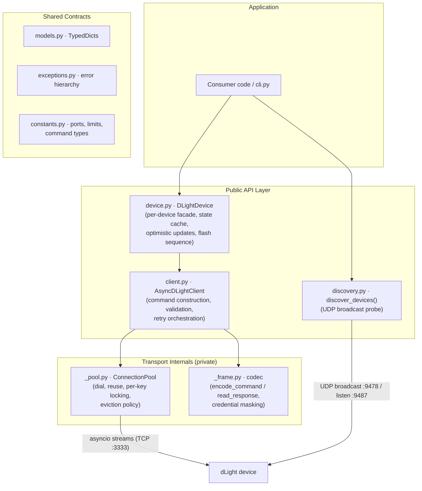

# dlight-client — Technical Architecture

**Version:** 1.6.0 · **Runtime:** Python ≥ 3.9, `asyncio`, zero third-party dependencies · **Transport:** raw TCP + UDP broadcast on the local network

dLight devices are Wi-Fi smart lamps controlled entirely over the LAN — there is no cloud relay. The library's job is to (1) find lamps on the network, (2) speak their proprietary JSON-over-TCP protocol reliably over flaky Wi-Fi, and (3) present a typed, object-oriented surface that hides connection lifecycle and wire framing from the application.

---

## 1. High-Level Architecture & Component Overview

**Component responsibilities:**

| Component | Responsibility | Knows about |
|---|---|---|
| `DLightDevice` | Binds `(ip, device_id)` to a client; caches device state; applies optimistic updates with rollback; composite behaviors (`flash`) | `AsyncDLightClient`'s public methods only |
| `AsyncDLightClient` | Builds command dicts (IDs, types, range validation), runs the retry loop, maps one command to one request/response exchange | Pool and codec interfaces; never touches sockets directly |
| `ConnectionPool` (private) | Full connection lifecycle: dialing with timeout, persistent reuse keyed by `(host, port, ssl)`, per-key mutual exclusion, single-point eviction | asyncio streams; raises `DLightConnectionError`/`DLightTimeoutError` |
| `_frame` codec (private) | Stateless wire format: serialize commands, read/validate framed responses, mask credentials for logging | Bytes and dicts only; no sockets, no client state |
| `discovery` | Fire-and-collect UDP broadcast; deduplicates responders by IP | Independent of the TCP stack entirely |
| `models` / `exceptions` / `constants` | The contracts every layer shares: `CommandResult`, `DeviceState`, `DeviceInfo` TypedDicts; the `DLightError` hierarchy; ports and protocol literals | Nothing (leaf modules) |

The layering rule: **public modules (`client`, `device`, `discovery`) never duplicate transport logic; private modules (`_pool`, `_frame`) never construct commands or interpret device semantics.** `_async_send_tcp_command` on the client is the single seam between the two worlds — it is deliberately name-stable because tests and downstream code stub it as the boundary.

---

## 2. Core Data Flow & Lifecycle

### Command path (top → hardware)

A call like `device.set_brightness(40)` flows through five distinct stages:

1. **Facade & optimistic state** — `DLightDevice` validates nothing itself; it snapshots its local state cache, applies the new value optimistically, and delegates to the client. On *any* exception it rolls the cache back, so the cache never reflects a command the device didn't acknowledge.
2. **Command construction** — `AsyncDLightClient.set_brightness` range-checks (`0–100`; color temp `2600–6000 K`) and builds the command dict: a generated `commandId` (`<epoch-ms>_<4-byte hex>`), `deviceId`, a `commandType` (`EXECUTE`, `QUERY_DEVICE_STATES`, `QUERY_DEVICE_INFO`, `SSID_CONNECT`), and a `commands` list payload.
3. **Serialization** — `encode_command()` produces the wire bytes once, before the retry loop, so serialization failures (`DLightCommandError`) are never retried.
4. **Exchange** — the retry loop acquires a connection via `async with pool.connection(host, port, ssl, timeout)`, writes the bytes, and awaits `read_response()`. One `async with` block = exactly one request/response exchange.
5. **Response interpretation** — the codec returns a parsed `CommandResult` dict; the facade extracts what it needs (e.g., the `states` sub-dict) and refreshes its cache.

### Response path (hardware → top)

The protocol is strictly request/response — the device never pushes unsolicited TCP data, so there is no event subscription machinery. `read_response()` performs the entire upward translation: framed bytes → validated dict → typed `CommandResult`, raising on anything anomalous (see §4). The only "event-like" inbound path is **discovery**: a `DatagramProtocol` collects UDP responses for a fixed listening window and returns a batch of device-info dicts; there is no ongoing subscription.

### Connection state, retries, disconnections

- **Two connection modes.** `persistent=False` (default): dial → exchange → close, per command. `persistent=True`: after a clean exchange the connection is returned to the pool under its `(host, port, ssl)` key and reused until `idle_timeout` (default 60 s) elapses or the peer closes it. `client.close()` / `async with client:` tears down the pool.
- **Retry policy lives in one loop.** Only `DLightTimeoutError` and `DLightConnectionError` are retryable (transient network conditions); backoff is exponential (`retry_backoff · 2^attempt`), default `max_retries=0`. Protocol-level failures (`DLightResponseError`, non-`SUCCESS` status) are **never** retried — re-sending a command the device rejected or garbled is unsafe for stateful hardware.
- **Eviction is unconditional on failure.** The pool's context manager closes and discards a connection if the exchange body raises *any* exception — including timeouts. This is a deliberate invariant: a stream that failed mid-exchange may have a late response still in flight, and reusing it would desynchronize every subsequent request/response pairing on that socket (the device does not echo `commandId` reliably enough to re-correlate). The cost — an occasional unnecessary reconnect after a benign error — is accepted in exchange for making desync structurally impossible.
- **Transparent reconnection on stale connections.** If a connection error occurs on a reused (not freshly opened) persistent connection, the pool transparently discards it, establishes a new connection, and retries the failed operation once. Only if the retry also fails does the error propagate to the caller. Failure on a brand-new connection is never retried.
- **Disconnections** surface as three distinct codec/pool errors so callers can react differently: connection refused/unreachable (`DLightConnectionError`), dead air (`DLightTimeoutError`), and mid-frame peer close (`DLightResponseError`, since a half-frame implies a protocol-level fault, not just a network blip).

---

## 3. Key Design Patterns & Technical Decisions

**Layered architecture with a facade.** `DLightDevice` is a per-device facade over the stateless-per-call `AsyncDLightClient`. The client is multi-device (every method takes `target_ip`/`device_id`); the facade binds identity. This split lets one client (and its pool) serve many lamps while applications hold one object per lamp.

**Resource-acquisition via async context manager (pool checkout/release).** `ConnectionPool.connection()` is an `@asynccontextmanager` implementing checkout/release semantics: the entry is *removed* from the pool while in use, returned only on clean exit. This concentrates the entire eviction policy in one `try/except/else` instead of scattering pool-removal calls across every error handler — the design's central reliability decision.

**Per-key mutual exclusion, not multiplexing.** The wire protocol has no framing for concurrent in-flight requests, so the pool serializes access per `(host, port, ssl)` key with an `asyncio.Lock`. Lock creation uses `dict.setdefault`, which is race-free in asyncio's cooperative model because it contains no await point — concurrent first commands to a device are guaranteed to observe the same lock and share one connection. Commands to *different* devices proceed fully concurrently.

**Codec as pure functions, not a class.** Framing (`_frame.py`) is deliberately stateless — bytes in, dict out, exceptions for anomalies. This makes the trickiest code path (binary protocol parsing) unit-testable with an in-memory `StreamReader` and no mocks, and means the pool and codec are composable without shared state.

**Optimistic concurrency on the state cache.** `DLightDevice` mutates its cache before the network call and rolls back on failure. Chosen because lamp UIs want instant feedback and the device offers no change-notification channel; the trade-off (a brief window of incorrect local state if the command fails) is bounded by the rollback.

**Retry-around-exchange, not retry-inside-transport.** The retry loop wraps the *whole* acquire-write-read exchange. Each attempt gets a fresh connection (the failed one was evicted), which is the only sound granularity when you can't re-correlate responses.

**Error taxonomy as control flow.** The exception hierarchy is designed for `except` granularity: `DLightTimeoutError` ⊂ `DLightConnectionError` ⊂ `DLightError`, with `DLightCommandError`/`DLightResponseError` as non-retryable siblings. The retry loop's behavior is defined entirely by this taxonomy.

**Testing philosophy as architecture.** The suite runs against `FakeDLightServer` (`tests/fake_server.py`) — a real in-process `asyncio.start_server` speaking the actual wire protocol with scriptable faults (hangs, RSTs, truncated frames, stale delayed replies). Tests assert observable behavior (connection counts, bytes exchanged), not internal call sequences, which is what permits transport refactoring without test churn. Two regression tests (`tests/test_pool_regressions.py`) permanently encode the pool's concurrency invariants.

---

## 4. Hardware/Protocol Abstraction Layer

The device exposes two proprietary protocols, both LAN-local and unauthenticated by default (TLS optional):

### Control channel — JSON over TCP (port 3333)

**Asymmetric framing** is the protocol's defining quirk:

- **Request:** bare UTF-8 JSON, no length prefix, no delimiter. The device parses opportunistically.
- **Response:** a 4-byte **big-endian length prefix**, then exactly that many bytes of UTF-8 JSON.

`read_response()` enforces, in order: header completeness → payload length ≤ **10 KiB** (`MAX_PAYLOAD_SIZE`, a defense against a corrupt header causing an unbounded read) → payload completeness → UTF-8/JSON validity → echo detection (a device that doesn't recognize a command echoes it verbatim; treated as `DLightResponseError`) → `status == "SUCCESS"`. Two semantic special cases live in the codec, not the client: a **zero-length payload is an acknowledgement** and is synthesized into `{"status": "SUCCESS"}`, and every non-`SUCCESS` status is promoted to an exception so callers never branch on status strings.

**TLS** is opt-in (`ssl=True` or a custom `SSLContext`); the pool keys connections by SSL identity so differently-configured contexts never share a socket. Credentials in `SSID_CONNECT` payloads are masked by the codec before any log line is emitted.

### Discovery channel — UDP broadcast

`discover_devices()` opens two datagram endpoints: a listener on local port **9487** and a sender that broadcasts a **fixed magic probe payload** (a constant hex string the firmware pattern-matches) to port **9478** at `255.255.255.255`. Devices reply with a single JSON datagram of identity metadata (`deviceId`, `deviceModel`, versions); the library stamps each with its source `ip_address`, deduplicates by IP, and returns the batch after a fixed listening window (default 3 s). Discovery is best-effort and fully decoupled from the TCP stack — its results are plain dicts the caller feeds into `DLightDevice(ip, device_id, client)`.

### Provisioning path

A factory-reset lamp runs a SoftAP at the fixed address **192.168.4.1**. `connect_to_wifi()` targets that IP by default with an `SSID_CONNECT` command carrying Wi-Fi credentials; the device then joins the real network and becomes discoverable via the UDP channel. This is the same TCP protocol, just a different default endpoint — no separate provisioning stack.

---

**Where to start contributing:** the seams are `_async_send_tcp_command` (client ↔ transport), `pool.connection()` (lifecycle policy), and `read_response()` (wire semantics). Roadmap items DL-002/004/005 (`issues/`) extend the CLI, add mDNS discovery alongside the UDP probe, and deepen `DLightDevice` state caching — all of which sit *above* the transport seam and shouldn't need to touch `_pool`/`_frame`.
