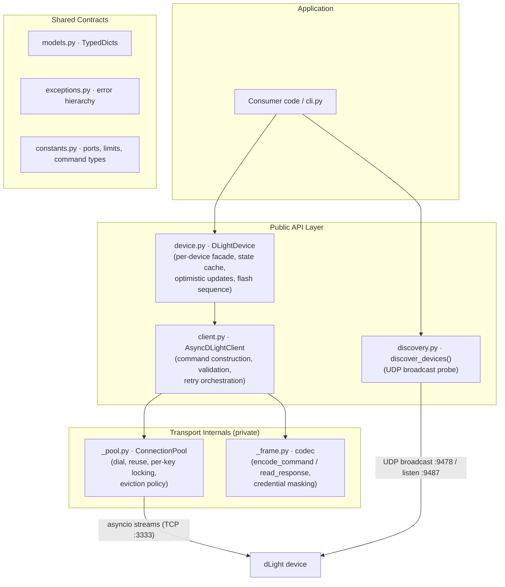

# Architecture

**Runtime:** Python ≥ 3.9 · `asyncio` · zero third-party dependencies  
**Transport:** raw TCP + UDP broadcast on the local network

dLight devices are Wi-Fi smart lamps controlled entirely over the LAN — there is no cloud relay. The library's job is to (1) find lamps on the network, (2) speak their proprietary JSON-over-TCP protocol reliably over flaky Wi-Fi, and (3) present a typed, object-oriented surface that hides connection lifecycle and wire framing from the application.

!!! tip "Contributing entry points"
    The architectural seams where new work attaches are `_async_send_tcp_command` (client ↔ transport), `pool.connection()` (lifecycle policy), and `read_response()` (wire semantics). See [Contributing](contributing.md) for setup instructions.

---

## Component overview

| Component | Responsibility | Knows about |
|---|---|---|
| `DLightDevice` | Binds `(ip, device_id)` to a client; caches device state; optimistic updates with rollback; composite behaviours (`flash`) | `AsyncDLightClient`'s public methods only |
| `AsyncDLightClient` | Builds command dicts, runs the retry loop, maps one command to one request/response exchange | Pool and codec interfaces; never touches sockets directly |
| `ConnectionPool` (private) | Full connection lifecycle: dialing with timeout, persistent reuse keyed by `(host, port, ssl)`, per-key mutual exclusion, single-point eviction | asyncio streams; raises `DLightConnectionError`/`DLightTimeoutError` |
| `_frame` codec (private) | Stateless wire format: serialise commands, read/validate framed responses, mask credentials for logging | Bytes and dicts only; no sockets, no client state |
| `discovery` | Fire-and-collect UDP broadcast; deduplicates by IP | Independent of the TCP stack |
| `models` / `exceptions` / `constants` | Shared contracts: TypedDicts, the `DLightError` hierarchy, ports and protocol literals | Nothing (leaf modules) |

**Layering rule:** public modules (`client`, `device`, `discovery`) never duplicate transport logic; private modules (`_pool`, `_frame`) never construct commands or interpret device semantics.

---

## Core data flow

### Command path (top → hardware)

A call like `device.set_brightness(40)` flows through five stages:

1. **Facade & optimistic state** — `DLightDevice` snapshots its cache, applies the new value optimistically, and delegates to the client. On any exception it rolls the cache back.
2. **Command construction** — `AsyncDLightClient.set_brightness` range-checks the value and builds the command dict: a generated `commandId`, `deviceId`, `commandType`, and a `commands` payload list.
3. **Serialization** — `encode_command()` produces wire bytes before the retry loop, so serialization failures are never retried.
4. **Exchange** — the retry loop acquires a connection via `async with pool.connection(host, port, ssl, timeout)`, writes the bytes, and awaits `read_response()`. One `async with` = exactly one request/response exchange.
5. **Response interpretation** — the codec returns a `CommandResult` dict; the facade extracts the `states` sub-dict and refreshes its cache.

### Connection state and retries

- **Two connection modes.** `persistent=False` (default): dial → exchange → close, per command. `persistent=True`: connections are pooled under `(host, port, ssl)` and reused until `idle_timeout` elapses or the peer closes them.
- **Retry policy lives in one loop.** Only `DLightTimeoutError` and `DLightConnectionError` are retryable. Protocol-level failures (`DLightResponseError`, non-SUCCESS status) are never retried.
- **Eviction is unconditional on failure.** The pool's context manager closes and discards a connection if the exchange body raises any exception. A stream that failed mid-exchange may have a late response still in flight; reusing it would desynchronise every subsequent request/response pair. The cost (an occasional unnecessary reconnect) is accepted in exchange for making desync structurally impossible.
- **Transparent reconnection on stale connections.** If a connection error occurs on a reused (not freshly opened) persistent connection, the pool transparently discards it, establishes a new connection, and retries the failed operation once. Only if the retry also fails does the error propagate to the caller. Failure on a brand-new connection is never retried.

---

## Key design decisions

**Resource-acquisition via async context manager.** `ConnectionPool.connection()` is an `@asynccontextmanager` implementing checkout/release: the entry is removed from the pool while in use and returned only on clean exit. This concentrates the entire eviction policy in one `try/except/else` block.

**Per-key mutual exclusion, not multiplexing.** The wire protocol has no framing for concurrent in-flight requests, so the pool serialises access per `(host, port, ssl)` key with an `asyncio.Lock`. Commands to different devices proceed fully concurrently.

**Codec as pure functions.** `_frame.py` is stateless — bytes in, dict out, exceptions for anomalies. This makes the trickiest code path unit-testable with an in-memory `StreamReader` and no mocks.

**Optimistic concurrency on the state cache.** `DLightDevice` mutates its cache before the network call and rolls back on failure. Bounded trade-off: brief incorrect local state if a command fails, in exchange for instant UI feedback.

**Error taxonomy as control flow.** `DLightTimeoutError` ⊂ `DLightConnectionError` ⊂ `DLightError`, with `DLightCommandError`/`DLightResponseError` as non-retryable siblings. The retry loop's behaviour is defined entirely by this hierarchy.

**Testing philosophy.** The suite runs against `FakeDLightServer` (`tests/fake_server.py`) — a real in-process `asyncio.start_server` speaking the actual wire protocol with scriptable faults (hangs, RSTs, truncated frames). Tests assert observable behaviour (connection counts, bytes exchanged), not call sequences.

---

## Wire protocol

### Control channel — JSON over TCP (port 3333)

Asymmetric framing:

- **Request:** bare UTF-8 JSON, no length prefix, no delimiter.
- **Response:** 4-byte big-endian length prefix, then exactly that many bytes of UTF-8 JSON.

`read_response()` enforces: header completeness → payload length ≤ 10 KiB (guard against corrupt headers) → UTF-8/JSON validity → echo detection → `status == "SUCCESS"`.

Special cases handled in the codec (not the client):

- **Zero-length payload** = acknowledgement; synthesised to `{"status": "SUCCESS"}`.
- **Echo detection** = device echoing the command verbatim → `DLightResponseError`.
- **Non-SUCCESS status** = promoted to `DLightCommandError`.

TLS is opt-in (`ssl=True` or custom `SSLContext`). The pool keys connections by SSL identity.

### Discovery channel — UDP broadcast

`discover_devices()` opens a listener on local port **9487** and broadcasts a fixed magic probe to port **9478**. Devices reply with a JSON datagram of identity metadata. Results are deduplicated by IP and returned after a fixed window (default 3 s).

### Provisioning path

A factory-reset lamp runs a SoftAP at **192.168.4.1**. `connect_to_wifi()` targets that IP with an `SSID_CONNECT` command. Same TCP protocol, different default endpoint.
