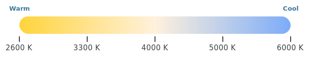

# Controlling Devices

`DLightDevice` is the recommended way to control a lamp. It wraps `AsyncDLightClient` with a per-device stateful interface, caching the last-known state and applying optimistic updates.

## Creating a device

```python
from dlightclient import AsyncDLightClient, DLightDevice

client = AsyncDLightClient()
lamp = DLightDevice(
    ip_address="192.168.1.123",
    device_id="DL12345",
    client=client,
)
```

| Parameter | Type | Description |
|---|---|---|
| `ip_address` | `str` | IP address of the lamp (from `discover_devices`). |
| `device_id` | `str` | Device identifier (from `discover_devices`). |
| `client` | `AsyncDLightClient` | Shared client instance. One client can drive many `DLightDevice` objects. |

## State-changing methods

All methods are `async` and return a `CommandResult` dict on success.

| Method | Parameters | Description |
|---|---|---|
| `turn_on()` | — | Powers the lamp on. |
| `turn_off()` | — | Powers the lamp off. |
| `toggle()` | — | Toggles power on/off; uses the state cache to avoid an extra network call. |
| `set_brightness(brightness)` | `int` 0–100 | Sets brightness as a percentage. |
| `set_color_temperature(temperature)` | `int` 2600–6000 | Sets colour temperature in Kelvin. |

```python
await lamp.turn_on()
await lamp.set_brightness(80)
await lamp.set_color_temperature(2700)  # warm, candle-like
await lamp.toggle()                     # off → on, or on → off
```

### Colour temperature range



The lamp accepts integer Kelvin values between **2600 K** (warm amber) and **6000 K** (cool daylight). Values outside this range raise `DLightCommandError`.

## Reading state

### `get_state(force_update=False)`

Returns a `DeviceState` dict describing the lamp's current state.

```python
state = await lamp.get_state()
# {'on': True, 'brightness': 80, 'color': {'temperature': 2700}}

# bypass the cache and query the device directly
state = await lamp.get_state(force_update=True)
```

By default, `get_state()` returns the cached value populated by the most recent command. If no command has been sent yet, it queries the device. Pass `force_update=True` to always query the device.

### `get_info()`

Returns a `DeviceInfo` dict with hardware metadata.

```python
info = await lamp.get_info()
# {'deviceId': 'DL12345', 'deviceModel': '...', 'swVersion': '...', 'hwVersion': '...', 'macAddress': '...'}
```

## State caching and optimistic updates

`DLightDevice` maintains an internal cache (`_state`). When you call `set_brightness(50)`:

1. The cache is updated to `brightness: 50` **before** the network call.
2. The command is sent to the lamp.
3. If the command fails, the previous cache value is restored.

This means `get_state()` returns immediately after a successful command without a second round-trip, and UI state is consistent even while the command is in flight.

## Reacting to state changes

Register a callback with `on_state_change` to be notified whenever the device state changes. Both sync and async callables are supported.

```python
def on_change(device, old_state, new_state):
    print(f"[{device.id}] {old_state} → {new_state}")

lamp.on_state_change(on_change)

await lamp.turn_on()
# [DL12345] {} → {'on': True}

await lamp.set_brightness(60)
# [DL12345] {'on': True} → {'on': True, 'brightness': 60}
```

Use an async callback to feed state into another coroutine, for example an `asyncio.Queue`:

```python
queue = asyncio.Queue()

async def on_change(device, old_state, new_state):
    await queue.put(new_state)

lamp.on_state_change(on_change)
```

To stop receiving events, pass the same callable to `remove_state_listener`:

```python
lamp.remove_state_listener(on_change)
```

**Exceptions in callbacks are caught and logged** — they never interrupt the command that triggered the change.

!!! warning "Physical button presses are not detected"
    Callbacks only fire for changes made **through this client instance**. If someone physically presses the button on the lamp, or another app sends a command, the library cannot detect it automatically. To pick up external changes, call `get_state(force_update=True)` and the callback will fire if the device reports a different state than the cache:

    ```python
    # Poll every 10 s to catch external changes
    while True:
        await lamp.get_state(force_update=True)
        await asyncio.sleep(10)
    ```

    A dedicated `watch()` helper that automates this is planned.

## Flash sequence

```python
success = await lamp.flash(
    flashes=3,        # number of on/off cycles
    on_duration=0.3,  # seconds lamp stays on each flash
    off_duration=0.3, # seconds lamp stays off each flash
)
```

`flash()` saves the current state (power, brightness, colour temperature), performs the flash sequence, then restores the saved state. Returns `True` if the full sequence completed, `False` if any step failed (state is still restored on failure).

## Wi-Fi provisioning

For a lamp in SoftAP (factory reset) mode at `192.168.4.1`:

```python
result = await client.connect_to_wifi(
    device_id="DL12345",
    ssid="MyNetwork",
    password="s3cret",
    # target_ip defaults to "192.168.4.1"
    # port defaults to 3333
)
```

This is handled directly on `AsyncDLightClient`, not `DLightDevice`, because the lamp is not yet on your home network when provisioning.
